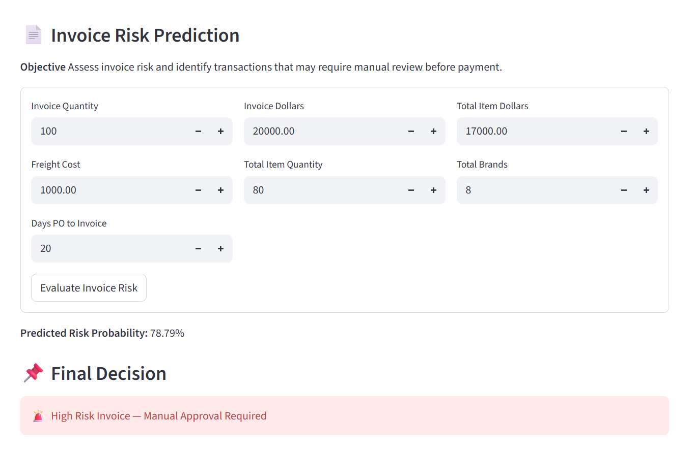
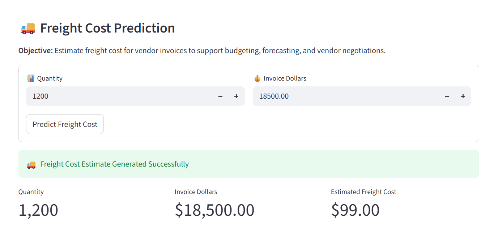

# 📊 Vendor Performance Analysis System (ML-Based)

## Project Overview

This project is a Machine Learning-based Vendor Performance Analysis System designed to evaluate vendor behavior, detect invoice risks, and predict freight costs using Python, SQL, SQLite, and Scikit-learn.

The system helps organizations improve procurement decisions by identifying abnormal invoices, predicting logistics costs, and reducing manual verification effort through automation.

It combines **Machine Learning, Rule-based logic, and Data Analysis** to build an intelligent vendor monitoring system.

---

## Key Business Insights

- Some vendor invoices show abnormal patterns in quantity, pricing, and delivery delays
- Freight costs vary significantly across vendors, impacting overall profitability
- Hybrid rule-based + ML approach improves invoice risk detection accuracy
- Automated invoice flagging reduces manual review workload
- Vendor performance can be evaluated using cost and risk patterns

---

## Business Problem

Organizations handling large volumes of vendor invoices often struggle with detecting billing anomalies, controlling freight overcharges, and reducing manual audit workload.
This leads to financial leakage and inefficiencies in procurement workflows.

This project provides a **data-driven automated solution** to solve these problems using machine learning.

---

## Dataset

The project uses structured vendor invoice and logistics data stored in SQLite.

- Vendor invoice records
- Freight and shipping data
- Purchase and transaction history

> **Note:** The dataset is stored in a local SQLite database (inventory.db) containing vendor invoice transactions, freight details, and purchase history.
> The dataset is stored locally in a SQLite database (inventory.db) and is not publicly shared due to confidentiality.

---

## Technology Stack

- Python
- Pandas
- NumPy
- Scikit-learn
- SQLite
- Streamlit
- Matplotlib
- Seaborn
- Joblib

---

## Project Workflow

Data Source (SQLite Database)  
→ Data Extraction  
→ Data Preprocessing  
→ Feature Engineering  
→ Rule-Based Logic  
→ Machine Learning Model Training  
→ Model Evaluation  
→ Inference Pipeline  
→ Streamlit Web Application

---

## Key Features

### 1. Invoice Risk Detection System
- Detects suspicious or abnormal invoices
- Uses hybrid approach:
  - Rule-based logic (quantity, delay, mismatch checks)
  - Machine Learning classification model
- Output: **Safe / Flagged for Manual Review**

---

### 2. Freight Cost Prediction System
- Predicts expected shipping/freight cost
- Learns from historical vendor shipping patterns
- Helps detect overcharging or cost deviations

---

### 3. Interactive Streamlit Dashboard
- Built using Streamlit
- Separate modules for:
  - Invoice Risk Prediction
  - Freight Cost Prediction
- Real-time prediction interface

---

## Machine Learning Models

### Invoice Flag Model
- Type: Classification
- Algorithm: Random Forest Classifier
- Output: Binary classification (0 = Safe, 1 = Flagged)

---

### Freight Cost Model
- Type: Regression
- Predicts continuous freight cost values
- Used for anomaly detection in logistics billing

---

## Model Performance

- Invoice Risk Classification Model (Random Forest Classifier)
  - Accuracy: 0.96
  - Precision: 0.99
  - Recall: 0.87
  - f1_score: 0.93

- Freight Cost Prediction Model (Linear Regression)
  - RMSE: 124.39
  - MAE: 24.40
  - r2: 97.00

> Models evaluated using train-test split with consistent random state for reproducibility.

---

## Project Structure

vendor-invoice-intelligence/
│
├── data/
│ └── inventory.db
│
├── freight/
│ ├── data_preprocessing.py
│ ├── model_evaluation.py
│ ├── train.py
│
├── invoice/
│ ├── feature_engineering.py
│ ├── rule_engine.py
│ ├── train.py
│
├── inference/
│ ├── predict_freight_cost.py
│ ├── predict_invoice_flag.py
│
├── models/
│ ├── invoice_model.pkl
│ ├── freight_model.pkl
│
├── notebooks/
│ ├── EDA_invoice.ipynb
│ ├── EDA_freight.ipynb
│
├── screenshots/
│ ├── freight_cost_prediction.png
│ ├── invoice_flag_prediction.png
│
├── app.py
├── README.md
└── requirements.txt

---

## Application Screenshots

### Invoice Risk Detection Module



### Freight Cost Prediction Module



---

## How to Run

### 1. Install dependencies

```bash
pip install -r requirements.txt
```

### 2. Run Streamlit app

```bash
streamlit run app.py
```

---

👨‍💻 Author

Ayush Raj
Machine Learning Engineer | Python | SQL | Data Analytics | Streamlit

---
